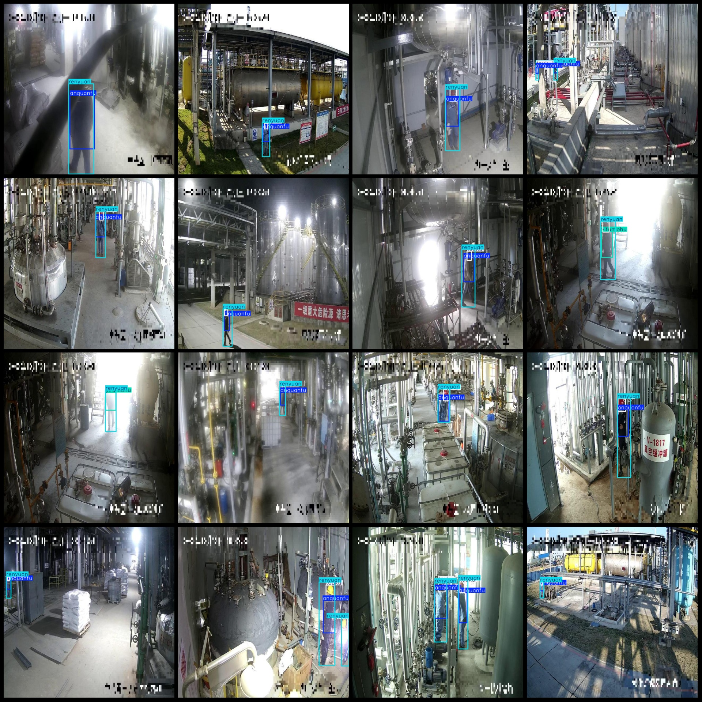
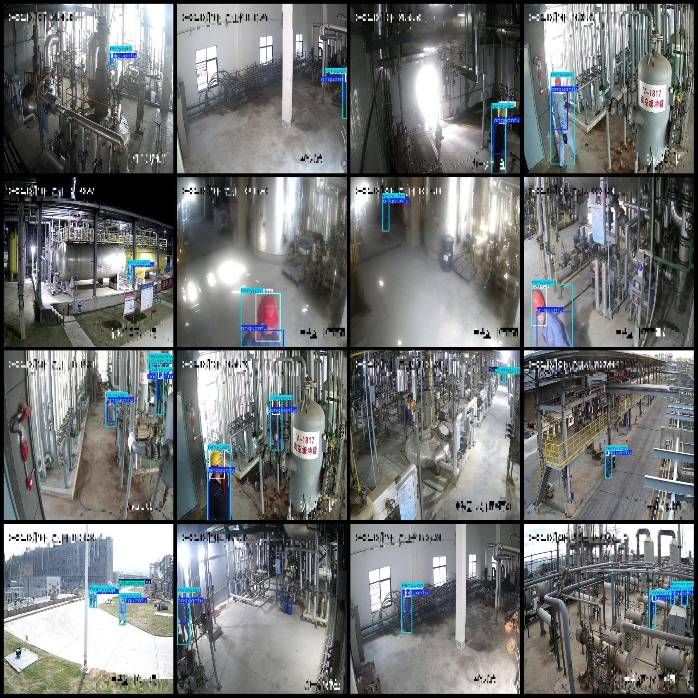

# Smart Factory Monitoring Perspective Safety Headgear and Other Protection Measures Detection Data Set VOC+YOLO Format 12369 Images 7 Categories

Dataset format: Pascal VOC format + YOLO format (without split path txt files, only containing jpg images and corresponding VOC format xml files and yolo format txt files)
number of images: 12369  
annotation count: 12369  
annotation count: 12369  
annotationnumber of classes: 7  
Annotation class names: ["anquanfu", "bianfu", "renyuan", "toubu", "toubumohu", "toukui", "yifumohu"]
["Safety suit", "Casual clothing", "Personnel", "Head", "Head obscured", "Helmets", "Clothes obscured"]
boxes per class:   
anquanfu box count = 14809  
bianfu box count = 779  
renyuan box count = 17004  
toubu box count = 1199  
toubumohu box count = 1131  
toukui box count = 14295  
yifumohu box count = 1322  
Total frames: 50,539
Number of images per category:
anquanfu images = 11184  
bianfu images = 711  
renyuan images = 12359  
toubu images = 878  
toubumohu images = 1001  
Toukui's ownership count = 10869
yifumohu images = 1147  
Image resolution: 640x640
Use annotation tool: labelImg
Markdown:

```
## classannotation rule
### Drawing a box around the class
```
Important note: The dataset does not have a split into training, validation, and test sets.
Special Disclaimer: This dataset does not guarantee the accuracy of the trained model or the weight files.
Preview of the image:
## Images





Here is a pay link on Stripe ( https://buy.stripe.com/3cs8yP7sY87d0vu9AB ). Please contact me lonlonago@foxmail.com after funding $89, and I will send you a complete data files , thank you!

